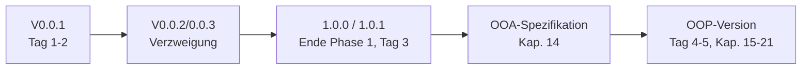

# Java Grundlagen

## Einführung in die Java-Programmierung (Seminar 3302)

**5 Tage · 09:00-16:30 (Tag 5 bis ca. 15:00) · Eclipse oder IntelliJ IDEA**

---

# Das Kursergebnis

Am Ende der Woche können Sie:

- Ausdrücke, Variablen, Verzweigung und Schleifen sicher lesen und schreiben,
- ein strukturiertes/prozedurales Java-Programm defensiv mit Exception
  Handling absichern,
- aus einer Klartextspezifikation per OOA eigene Klassen ableiten,
- Vererbung, Collections (`Array`/`ArrayList`) und Interfaces gezielt einsetzen,
- dieselbe Anwendung von strukturiert zu objektorientiert umbauen und die
  Vor-/Nachteile dieses Wechsels begründen.

Sichtbares Ergebnis: eine lauffähige Konsolenanwendung `ArithmeticTrainer`
(Kopfrechen-Trainer), am Ende der Woche in zwei Ausprägungen erlebt.

---

# Vorstellungsrunde

- Name und aktuelle Rolle
- bisherige Erfahrung mit Programmierung (auch: keine)
- Motivation, Java zu lernen
- Erwartungen an das Seminar

Persönliche Angaben sind freiwillig.

---

# Unser durchgehendes Beispiel: ArithmeticTrainer

Ein Kopfrechen-Trainer für 9-11-Jährige, der über die ganze Woche wächst:

- **Phase 1 (Kap. 1-12, Tag 1-3):** strukturiert/prozedural.
- **Phase 2 (Kap. 13-21, Tag 4-5):** von OOA direkt zu OOP.
- **Phase 3 (OOD, 3-Schichten):** bewusst nicht Teil dieses Seminars -
  Folgeseminar 3304 "Java Erweiterungen I".

Jede Übungsversion baut auf der Musterlösung der vorigen auf
(`x07_..._V0_0_1_solution` -> `x08a_..._V0_0_2_solution` usw.).

---

# Der Lernpfad

| Modul                                 | Tag | IHV-Kapitel | Leitfrage                                        | Sichtbares Ergebnis            |
| ------------------------------------- | --- | ----------- | ------------------------------------------------ | ------------------------------ |
| m01 Grundlagen                        | 1   | 1-5         | Was ist eine Anwendung, ein Objekt?              | erstes Programm, erste Objekte |
| m02 Verzweigung & Schleifen           | 2   | 6-9         | if/switch, Schleifenarten, Codestil, String      | `ArithmeticTrainer 0.0.4`      |
| m03 Exceptions & Abschluss Phase 1    | 3   | 10-13       | try-catch, defensive Programmierung              | `ArithmeticTrainer 1.0.1`      |
| m04 OOA -> OOP: Klassen & Collections | 4   | 14-18       | Spezifikation -> Klassen, Vererbung, `ArrayList` | erste OOP-Klassen              |
| m05 Interfaces & finale Version       | 5   | 19-21       | `Comparable`, Command-Pattern                    | vollständige OOP-Version       |

Details je Tag in [`02-plan.md`](../../02-plan.md).

---

# Tag 1: Anwendungen, Ausdrücke, Verzweigung, Objekte

**Ziel:** Das erste eigene Java-Programm läuft, erste Objekte werden erzeugt.

1. Was ist eine Anwendung, ein Algorithmus? Erstes Java-Programm (Kap. 1)
2. Ausdrücke und Variablen (Kap. 2)
3. einfache if-Anweisung (Kap. 3)
4. ein Objekt erzeugen und referenzieren (Kap. 4)
5. Konstruktoren, Konsolen-I/O (Kap. 5)

**Tagescheckpoint:** erste Iteration von `ArithmeticTrainer` mit Ein-/Ausgabe.

---

# Tag 2: Verzweigung, Schleifen, Codestil, String

**Ziel:** `ArithmeticTrainer` bekommt Menüsteuerung und eine Spielschleife.

1. if-else-if vs. switch-case (Kap. 6)
2. Inkrement/Dekrement, for-Schleife, Hauptprogrammschleife (Kap. 7)
3. Codestil: `final`, Versionsschema (Kap. 8)
4. Eigenheiten der Klasse `String` (Kap. 9)

**Tagescheckpoint:** `ArithmeticTrainer 0.0.4` mit voller Spielrunde.

---

# Tag 3: Exceptions, defensive Programmierung, Abschluss Phase 1

**Ziel:** Phase 1 (strukturiert/prozedural) wird abgeschlossen.

1. Exception Handling, `continue` (Kap. 10)
2. statische Methoden, defensive Programmierung (Kap. 11)
3. `ArithmeticTrainer 1.0.0`/`1.0.1`: Subtraktion, Multiplikation, Modulo (Kap. 12)
4. Ausblick: von der Spezifikation über OOA zur OOP (Kap. 13, optional)

**Tagescheckpoint:** `ArithmeticTrainer 1.0.1` - Phase 1 fertig.

---

# Tag 4: Von der OOA direkt zur OOP

**Ziel:** Dieselbe Anwendung wird aus einer Spezifikation heraus objektorientiert neu gebaut.

1. OOA einer Spezifikation, Musterlösung (Kap. 14)
2. erste eigene Klasse: access modifier, Getter/Setter, `this`, Konstruktor (Kap. 15)
3. `static`/`final` Fields, Vererbung, `toString()` (Kap. 16)
4. `Array` vs. `ArrayList` vs. `ArrayList` mit Generics, `class Round` (Kap. 17)
5. eigene checked Exception werfen (Kap. 18)

**Tagescheckpoint:** erste vollständige OOP-Klassen (`User`, `Task`, `Round`).

---

# Tag 5: Interfaces, Command-Pattern, finale Version

**Ziel:** `ArithmeticTrainer` liegt am Ende als vollständige OOP-Version vor.

1. 1:n-Beziehungen auf `Menu`/`MenuItem`, for-each, `StringBuilder` (Kap. 19)
2. Interfaces-Grundlagen, `java.lang.Comparable` (Kap. 20)
3. Command-Interface als Kern von `MenuItem` (Kap. 21)
4. Vollendung der OOP-Version, Feedbackrunde

**Abschluss:** "Das Seminar endet, das Lernen beginnt." - Anschluss an
Seminar 3304 "Java Erweiterungen I".

---

# Wichtige Rahmenbedingungen

- Musterlösungen erhalten Sie jeweils passend zur anstehenden Übung, nicht
  alle auf einmal - so bleibt der Lerneffekt erhalten.
- Ab Kap. 6 (`3302_K06.pdf`) baut eine Übung oft direkt auf der Musterlösung
  der vorigen auf - Kopieren/Umbenennen ist Teil der Übung, kein Nebenschauplatz.
- Puffer von 60-90 Min. am Tagesende ist eingeplant; wird bei Bedarf für
  nachgeholte optionale Übungen und Binnendifferenzierung genutzt.
- JLS-/Oracle-Tutorial-Zitate bleiben englisch und werden zusammenfassend
  vorgetragen statt ad hoc übersetzt.
