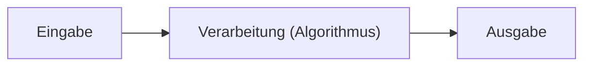
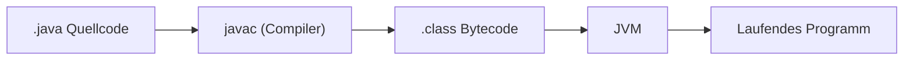
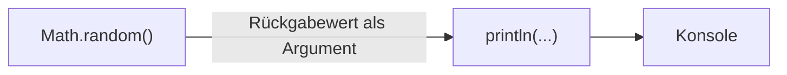

# Theorie: Einführung

Quelle: `3302_K01 (4).pdf` Kap. 1.1-1.8 (S. 1-1 bis 1-45). Eigene
Zusammenfassung, keine wörtliche Wiedergabe des Kapiteltexts.

**Leitfragen:** Was ist eine Anwendung? Was ist der Unterschied zwischen
Ausgabe und Rückgabewert? Wie wird aus Quellcode ein laufendes Programm?

---

## EVA-Prinzip

Jede Anwendung verarbeitet Eingaben zu Ausgaben. Die Verarbeitung heißt
**Algorithmus**.



---

## Funktion -> Methode

- Mathematische **Funktion**: Eingabewerte -> Ausgabewert.
- Java nennt das Konzept **Methode** (0..n Eingaben, 0..n Ausgaben).

```java
System.out.println("Hello World!"); // Methodenaufruf ohne Rückgabewertnutzung
```

---

## Compiler und JVM

"Einmal kompilieren, überall ausführen."



---

## Ausgabe vs. Rückgabewert

```java
System.out.println("Hello World!");   // Ausgabe, kein Rückgabewert nötig
System.out.println(Math.random());    // Rückgabewert wird an println weitergereicht
Math.random();                        // Rückgabewert geht verloren (kein Fehler!)
```

- `Math.random()` ist nicht-deterministisch: jeder Aufruf liefert einen
  anderen Wert.

---

## Rückgabewert als Funktionskomposition



Mathematisch: `f(g(x))` - erst `g(x)` berechnen, das Ergebnis an `f` geben.
`System.out.println(Math.random())` folgt demselben Muster.
