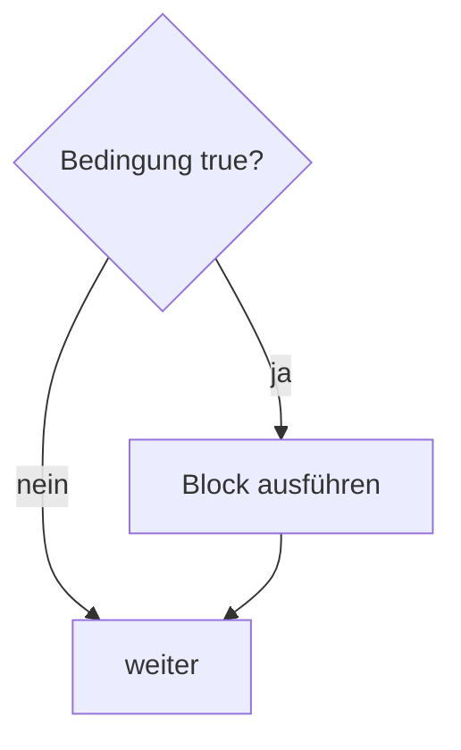
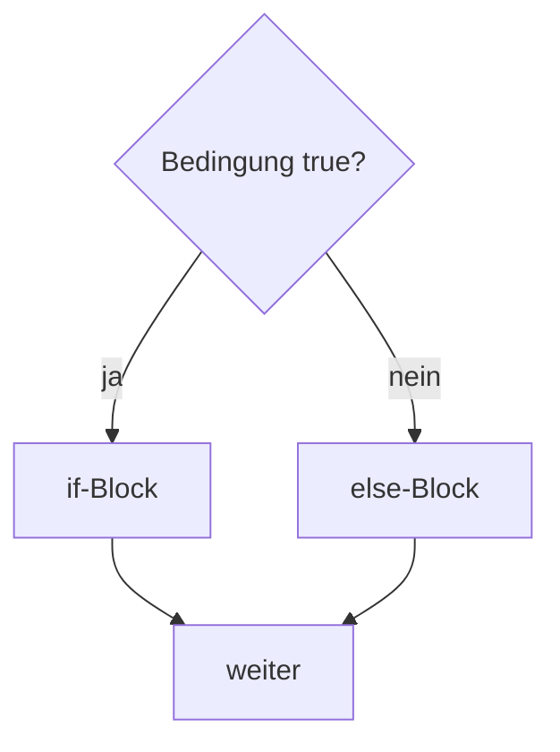

# Theorie: if-then-else-Anweisung

Quelle: `3302_K03.pdf` komplett (S. 3-1 bis 3-5). Eigene Zusammenfassung.

**Leitfrage:** Wie verzweigt ein Programm abhängig von einer Bedingung?

---

## if-then



```java
if (userSolution == result) {
    System.out.println("Correct! Well done :-)");
}
```

---

## if-then-else



```java
if (userSolution == result) {
    System.out.println("Correct! Well done :-)");
} else {
    System.out.println("Sorry, no, the correct answer is " + result);
}
```

- Genau **ein** Zweig wird ausgeführt, nie beide.
