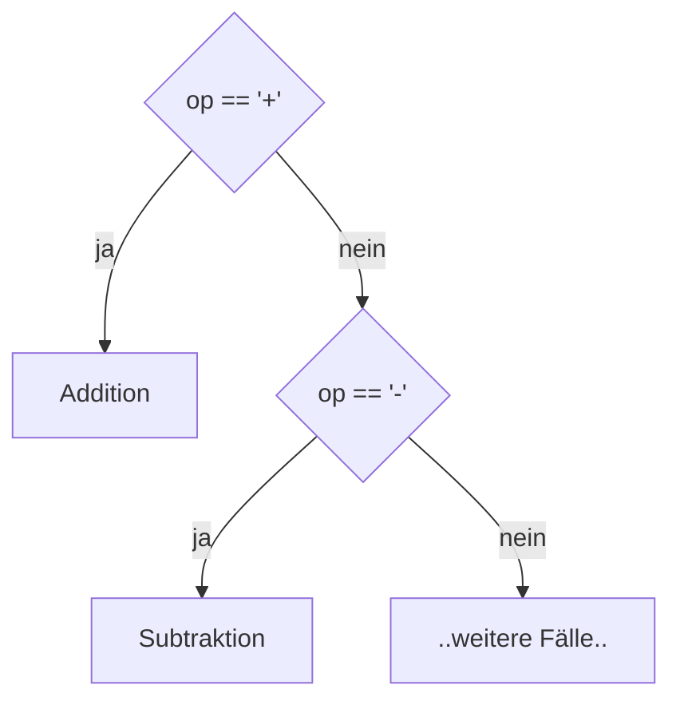

# Theorie: If-then-else-if vs. switch-case (Platzhalter)

**Status: Platzhalter.** Für Kap. 6 liegt bisher nur die IHV-Gliederung vor
(`3302_IHV (3).pdf`, S. IHV-3), kein vollständiges Kapitel-PDF
(`3302_K06.pdf` fehlt noch, siehe `00-intake.md`). Die folgenden Punkte sind
allgemeines, sicheres Java-Grundwissen zu den IHV-Überschriften - **nicht**
die lizenzierte Kapitelformulierung. Bei Vorlage des Kapitel-PDFs ersetzen.

**Leitfrage:** Wie prüft man mehr als zwei sich ausschließende Fälle?

---

## if-then-else-if: exklusive Verzweigung



```java
if (op == '+') {
    result = operand1 + operand2;
} else if (op == '-') {
    result = operand1 - operand2;
} else {
    result = operand1 * operand2;
}
```

---

## switch-Anweisung

```java
switch (op) {
    case '+': result = operand1 + operand2; break; // break nicht vergessen!
    case '-': result = operand1 - operand2; break;
    default:  result = operand1 * operand2; break;
}
```

- Ohne `break`: **Fall-through** in den nächsten `case`.
- Seit Java 14: `case '+' -> result = operand1 + operand2;` (kein `break` nötig).
