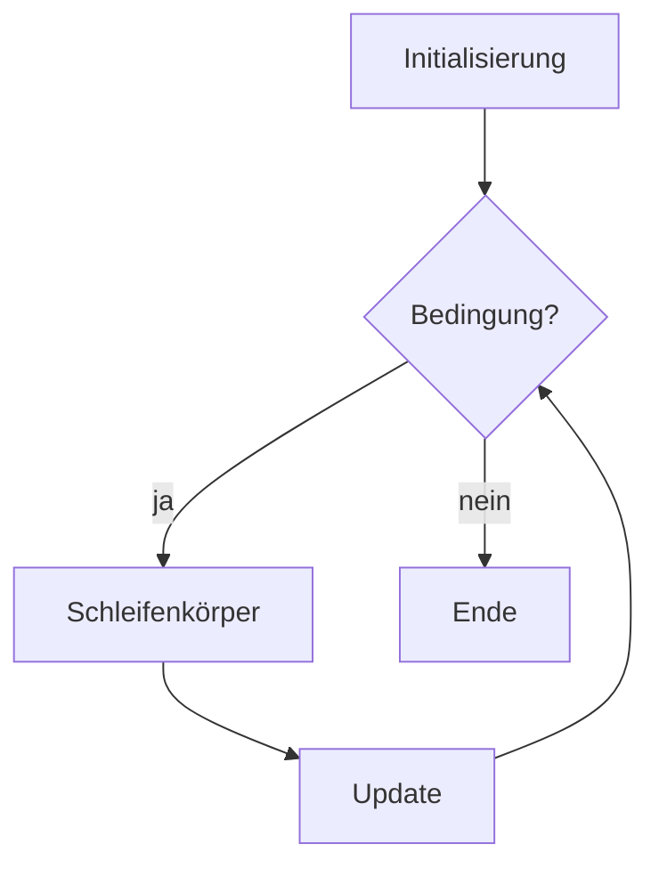
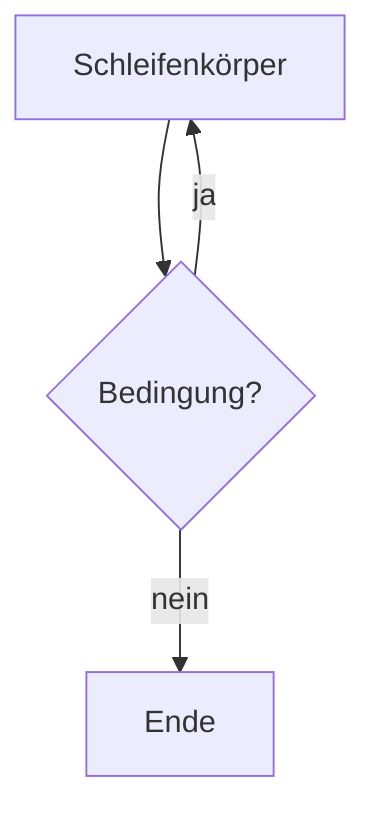

# Theorie: Schleifen I (Platzhalter)

**Status: Platzhalter.** Für Kap. 7 liegt bisher nur die IHV-Gliederung vor
(`3302_IHV (3).pdf`, S. IHV-4), kein vollständiges Kapitel-PDF
(`3302_K07.pdf` fehlt noch, siehe `00-intake.md`). Die folgenden Punkte sind
allgemeines, sicheres Java-Grundwissen zu den IHV-Überschriften - **nicht**
die lizenzierte Kapitelformulierung. Bei Vorlage des Kapitel-PDFs ersetzen.

**Leitfrage:** Wie wiederholt man Schritte, und wie stellt man sicher, dass
sie mindestens einmal laufen?

---

## Inkrement / Dekrement

```java
int i = 5;
System.out.println(i++); // 5 - Postfix: erst lesen, dann erhöhen
System.out.println(++i); // 7 - Präfix: erst erhöhen, dann lesen
```

---

## Die for-Schleife



```java
for (int taskNo = 1; taskNo <= noOfTasksPerRound; taskNo++) {
    System.out.println("Aufgabe " + taskNo);
}
```

---

## Die do-while-Schleife



```java
do {
    // mindestens einmal ausgeführt, z. B. eine Spielrunde anbieten
} while (userWantsAnotherRound);
```
