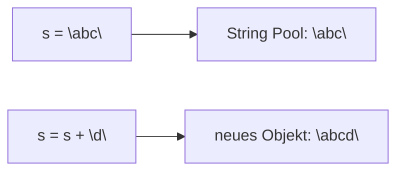

# Theorie: Die String-Klasse (Platzhalter)

**Status: Platzhalter.** Für Kap. 9 liegt bisher nur die IHV-Gliederung vor
(`3302_IHV (3).pdf`, S. IHV-4), kein vollständiges Kapitel-PDF
(`3302_K09.pdf` fehlt noch, siehe `00-intake.md`). Die folgenden Punkte sind
allgemeines, sicheres Java-Grundwissen zu den IHV-Überschriften - **nicht**
die lizenzierte Kapitelformulierung. Bei Vorlage des Kapitel-PDFs ersetzen.

**Leitfrage:** Worauf muss man beim Vergleichen und Verarbeiten von Strings
achten?

---

## String ist unveränderlich (immutable)



- Jede "Änderung" erzeugt ein **neues** `String`-Objekt.

---

## `==` vs. `.equals(...)`

```java
String a = "abc";
String b = "abc";
String c = new String("abc");

System.out.println(a == b);      // true  - selbes Pool-Objekt
System.out.println(a == c);      // false - unterschiedliche Objekte
System.out.println(a.equals(c)); // true  - gleicher Inhalt
```

- Für Inhaltsvergleiche **immer** `.equals(...)`, nie `==`.
- Weitere nützliche Methoden: `.equalsIgnoreCase(...)`, `.trim()`,
  `.length()`, `.toUpperCase()`/`.toLowerCase()`.
