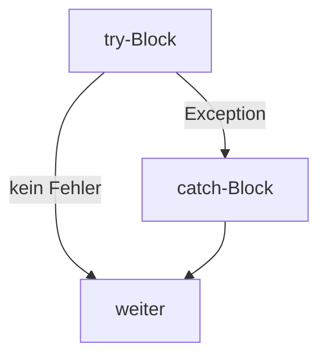
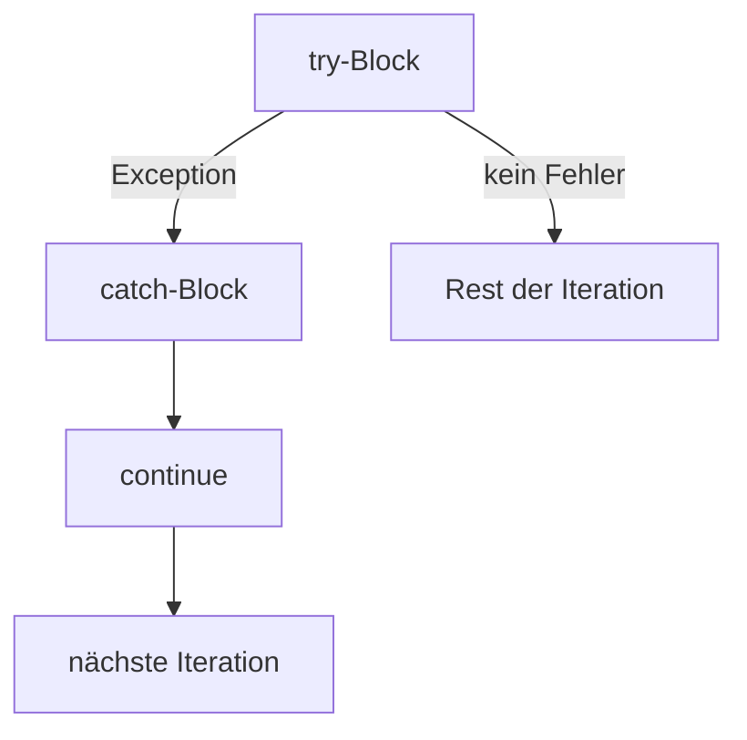

# Theorie: Exception Handling (I) (Platzhalter)

**Status: Platzhalter.** Für Kap. 10 liegt bisher nur die IHV-Gliederung vor
(`3302_IHV (3).pdf`, S. IHV-4), kein vollständiges Kapitel-PDF
(`3302_K10.pdf` fehlt noch, siehe `00-intake.md`). Die folgenden Punkte sind
allgemeines, sicheres Java-Grundwissen zu den IHV-Überschriften - **nicht**
die lizenzierte Kapitelformulierung. Bei Vorlage des Kapitel-PDFs ersetzen.

**Leitfrage:** Wie reagiert ein Programm auf Laufzeitfehler, ohne
abzustürzen?

---

## try-catch



```java
try {
    int userSolution = Integer.parseInt(reader.readLine());
} catch (NumberFormatException e) {
    System.out.println("Ungueltige Eingabe, bitte eine Zahl eingeben.");
}
```

---

## Ausnahmebehandlung mit `continue`



```java
for (int taskNo = 1; taskNo <= 3; taskNo++) {
    try {
        int userSolution = Integer.parseInt(reader.readLine());
    } catch (NumberFormatException e) {
        System.out.println("Ungueltige Eingabe.");
        continue; // springt direkt zur naechsten Aufgabe
    }
}
```
